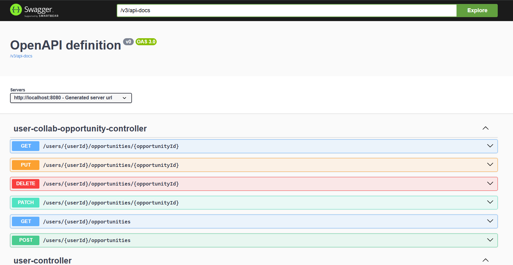
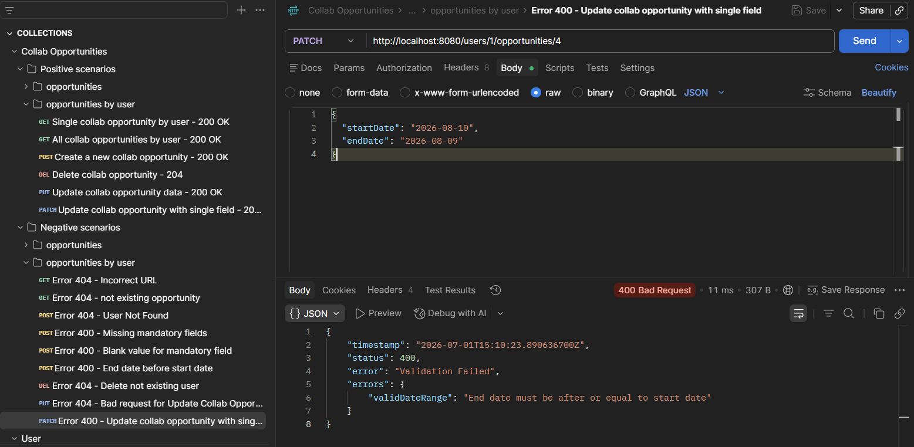

# InfluCollab

InfluCollab is a backend application designed to help content creators discover collaboration opportunities based on their travel plans.

Creators can publish upcoming trips and availability, allowing other creators to find potential collaborations in specific locations and time periods.

The project is being developed incrementally using an Agile approach, with each iteration delivering a complete and tested piece of functionality.

---

## Current Features

### User Management

- Create influencer profiles
- Retrieve all profiles
- Retrieve a profile by ID
- Update profile information
- Delete profiles

### Collaboration Opportunities

Users can manage their own collaboration opportunities.

Implemented endpoints include:

- Create a collaboration opportunity
- Retrieve all opportunities
- Retrieve a single opportunity
- Retrieve all opportunities created by a specific user
- Retrieve a specific opportunity belonging to a user
- Update an opportunity (PUT)
- Partially update an opportunity (PATCH)
- Delete an opportunity

Each opportunity contains:

- title
- city
- travel dates
- description
- owner

### Validation & Error Handling

Implemented validation and exception handling for common API scenarios:

- Invalid request data (`400 Bad Request`)
- Non-existing users (`404 Not Found`)
- Non-existing collaboration opportunities (`404 Not Found`)
- Duplicate email addresses (`409 Conflict`)
- Business validation for travel date ranges

### API Documentation

Interactive API documentation is available through Swagger UI:

`http://localhost:8080/swagger-ui/index.html`

### API Testing

A Postman collection is included with positive and negative test scenarios.

Location:

`/postman/User.postman_collection.json`

---

## Backend Concepts Demonstrated

The project currently demonstrates:

- REST API design
- Layered architecture
- Spring Data JPA
- Entity relationships
- DTO pattern
- Entity-to-DTO mapping
- Bean Validation
- Global exception handling
- Custom exceptions
- Repository query methods
- CRUD operations
- Swagger / OpenAPI documentation

---

## Technology Stack

- Java 21
- Spring Boot
- Spring Data JPA
- PostgreSQL
- Maven
- Swagger / OpenAPI
- Postman

---

## Project Structure

The application follows a layered architecture:

- Controller
- Service
- Repository
- Persistence (PostgreSQL)

Additional components:

- DTO layer
- Global exception handling
- Request validation
- OpenAPI documentation

